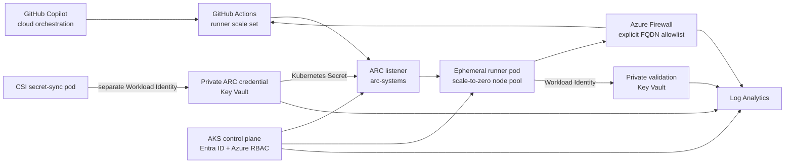

# Self-hosted GitHub Copilot agent on AKS

This proof of concept runs GitHub Copilot coding agent jobs on ephemeral
[Actions Runner Controller (ARC)](https://docs.github.com/actions/hosting-your-own-runners/managing-self-hosted-runners-with-actions-runner-controller/about-actions-runner-controller)
runners in Azure Kubernetes Service (AKS). It is scoped to
`rmoreirao/SelfHostedGHCopilotAgent` and does not require GitHub Enterprise.

The implementation follows GitHub's
[self-hosted Copilot runner guidance](https://docs.github.com/copilot/how-tos/copilot-on-github/customize-copilot/customize-the-agent-environment#using-self-hosted-github-actions-runners):
the runner scale set is selected by `.github/workflows/copilot-setup-steps.yml`,
runners are single-use, and the GitHub-integrated Copilot firewall is replaced
by network controls in Azure.

> [!WARNING]
> Azure Firewall Standard is the largest cost in this PoC and is billed while
> deployed. The AKS system pool always runs two nodes. Use
> `scripts/Destroy-Poc.ps1` when the environment is no longer needed.

## Architecture



The deployment creates:

- AKS Standard with Azure CNI Overlay, Cilium policy, OIDC, Workload Identity,
  disabled local accounts, Azure RBAC, Container Insights, and Key Vault CSI.
- A two-node system pool and a tainted runner pool that scales from zero to
  three `Standard_D4s_v6` nodes.
- Azure Firewall Standard, a static public IP, a UDR, DNS proxy, and explicit
  GitHub, Copilot, AKS, identity, and monitoring egress rules.
- Two private Key Vaults. Runner pods can read only the non-sensitive
  validation marker; ARC credentials are accessible only to the CSI sync pod.
- ARC `0.14.2` with runner image
  `ghcr.io/actions/actions-runner:2.337.0`, `minRunners: 0`, and
  `maxRunners: 3`.
- Default-deny Cilium policies in both ARC namespaces. Runner pods can reach
  DNS, the Kubernetes API without an API token, firewall-controlled public
  HTTPS, and only the validation vault private endpoint.

No existing VNet, Key Vault, private endpoint, or other private resource is
connected to the PoC.

## Security boundaries and trade-offs

- The repository is public. Its ARC workflows run only by manual dispatch, and
  runners receive access only to newly created PoC resources.
- The AKS API is public without an IP allowlist, as selected for this PoC.
  Microsoft Entra authentication, Azure RBAC, and disabled local accounts are
  still enforced. Production should use a private cluster or authorized IPs.
- Runner workspaces use `emptyDir`; ARC deletes each pod after one job. No
  Docker-in-Docker, privileged containers, or Kubernetes container hooks are
  enabled.
- Runner service accounts do not receive Kubernetes RBAC and do not mount the
  normal Kubernetes API token. The projected Workload Identity token is
  audience-limited.
- The GitHub App private key never enters a runner pod. Deployment passes it to
  ARM in a short-lived, access-restricted parameter file and deletes that file
  in a `finally` block.
- The non-secret validation vault URL, marker name, and expected marker value
  are injected into runner pods. GitHub's generated Copilot workflow does not
  expose repository variables to custom setup steps.
- Setup steps are evidence, not a security boundary: GitHub can start Copilot
  after a failed setup step. Azure Firewall, identity, and network policy
  enforce isolation independently.
- GitHub's ARC documentation describes organization-owned Apps. This PoC uses
  repository-level registration and a private, personal-account-owned App with
  repository `Administration: read/write` and `Metadata: read` permissions.
  The deployment's live registration test is the compatibility gate.

## Prerequisites

- An Azure subscription where the signed-in identity can create role
  assignments and the resources in this repository.
- Azure CLI with Bicep, GitHub CLI, PowerShell 7, Helm 3, `kubectl`, and
  `kubelogin`.
- An authenticated GitHub CLI session with `repo` and `workflow` scopes.
- Permission to manage repository settings and create a private GitHub App.
- Sufficient West Europe quota for two `Standard_D2s_v6` nodes and up to three
  `Standard_D4s_v6` nodes.

Confirm the active identities before deployment:

```powershell
az account show --query '{subscription:name, tenant:tenantId, user:user.name}'
gh auth status
```

## Deploy

The GitHub App manifest flow opens two browser pages. Approve creation of the
private App, then install it with **Only select repositories** and select only
`SelfHostedGHCopilotAgent`.

```powershell
pwsh ./scripts/New-ArcGitHubApp.ps1
pwsh ./scripts/Deploy-Poc.ps1
```

If the terminal is interrupted after App creation, recover the generated key
and verify the installation without creating a second App:

```powershell
pwsh ./scripts/New-ArcGitHubApp.ps1 `
  -ExistingAppSlug <app-slug> `
  -InstallationId <installation-id> `
  -Force
```

`Deploy-Poc.ps1` is idempotent. It validates Bicep, creates the subscription
deployment, writes App credentials to the private ARC vault, connects to AKS,
synchronizes the Kubernetes Secret, and installs both ARC charts.

Non-secret outputs are stored in `.local/deployment-outputs.json`. The App
private key and local App state are stored under `.local/`, restricted to the
current user, and ignored by Git.

## Configure Copilot

Self-hosted Copilot runners do not work with GitHub's integrated agent
firewall. In the repository, open **Settings > Copilot > Coding agent** and
disable the firewall before starting validation:

<https://github.com/rmoreirao/SelfHostedGHCopilotAgent/settings/copilot/coding_agent>

Audit the setting through the read-only API:

```powershell
gh api `
  -H "X-GitHub-Api-Version: 2026-03-10" `
  repos/rmoreirao/SelfHostedGHCopilotAgent/copilot/cloud-agent/configuration `
  --jq .is_firewall_enabled
```

The result must be `false`.

## Validate

Validate the static Azure and Kubernetes configuration:

```powershell
pwsh ./scripts/Test-Infrastructure.ps1 -RequireCopilotFirewallDisabled
```

Run the complete proof:

```powershell
pwsh ./scripts/Test-EndToEnd.ps1
```

The end-to-end test:

1. Dispatches `ARC smoke test` to `copilot-aks-poc`.
2. Observes creation of an ephemeral runner pod.
3. Exchanges its projected identity token and reads the marker through the
   validation vault private endpoint.
4. proves that `https://example.com` is denied by Azure Firewall.
5. proves that the runner pod is deleted after the job.
6. starts a real Copilot coding agent task.
7. verifies setup logs came from the AKS runner and include private-resource
   validation.
8. verifies Copilot opens a pull request changing only
   `validation/copilot-aks-proof.txt`.

The proof pull request remains open. Non-secret run, session, and pull-request
links are stored in `.local/evidence.json`.

Useful live diagnostics:

```powershell
kubectl get pods -A -w
kubectl get autoscalingrunnersets,ephemeralrunnersets,ephemeralrunners -n arc-runners
kubectl logs -n arc-runners -l actions.github.com/scale-set-name=copilot-aks-poc
az monitor log-analytics workspace show -g rg-copilot-aks-poc-weu
```

## Cleanup

The destroy script first uninstalls the scale set so ARC can deregister it,
then removes the controller and Azure resource group:

```powershell
pwsh ./scripts/Destroy-Poc.ps1
```

Delete the GitHub App registration and its local private key as part of
cleanup:

```powershell
pwsh ./scripts/Destroy-Poc.ps1 -DeleteGitHubApp
```

After cleanup, re-enable GitHub's integrated Copilot firewall before selecting
a GitHub-hosted runner again. The validation pull request is intentionally
left open as evidence.

## Repository layout

| Path | Purpose |
| --- | --- |
| `infra/` | Subscription-scope modular Bicep |
| `deploy/kubernetes/` | Namespaces, identities, CSI sync, and network policy |
| `deploy/arc/` | Pinned controller values and rendered runner template |
| `.github/workflows/copilot-setup-steps.yml` | Selects the ARC scale set for Copilot |
| `.github/workflows/arc-smoke-test.yml` | Deterministic runner smoke test |
| `scripts/Deploy-Poc.ps1` | End-to-end deployment orchestration |
| `scripts/Install-Arc.ps1` | Idempotent Kubernetes and Helm deployment |
| `scripts/Test-Infrastructure.ps1` | Azure and Kubernetes assertions |
| `scripts/Test-EndToEnd.ps1` | ARC and real Copilot validation |
| `scripts/Destroy-Poc.ps1` | Idempotent cleanup |
